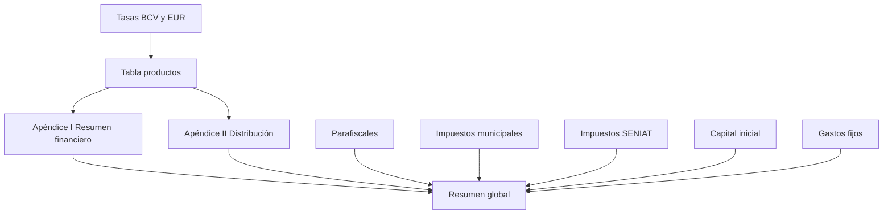

# Calculadora Empresarial Venezuela — Documentación funcional

Fuente: `calculadora_emprendedor_venezuela (1).html`  
Autoría UI: Ledezma Digital Agency  
Propósito: herramienta **offline / single-file** para emprendedores en Venezuela: costos, precios, márgenes, distribución de ingresos, parafiscales, impuestos municipales/nacionales, capital y gastos fijos.

> Los datos fiscales son **referenciales**. La herramienta no sustituye a un contador certificado.

---

## 1. Contexto del producto

| Aspecto | Detalle |
|--------|---------|
| Idioma | Español (VE) |
| Monedas | Bs, USD, EUR (conversión vía tasas editables) |
| Localidad editable | Estado + ciudad (default: Carabobo / Valencia) |
| Persistencia | Ninguna (todo en memoria / DOM) |
| Arquitectura | HTML + CSS + JS vanilla en un solo archivo |
| Marca | Logo “LD / LEDEZMA Digital Agency” |

### Flujo general



---

## 2. Modelo de datos (estado global)

### Tasas

| Variable | Default | Uso |
|----------|---------|-----|
| `tasa` | `40.50` | Bs/USD (BCV) |
| `tasaEUR` | `44.20` | Bs/EUR |

### Productos (`rows[]`)

```js
{ desc, cant, costoUSD, margen, pvRef, pvDivisa } // pvDivisa: 'usd' | 'eur'
```

- **Costo unit. Bs** = `costoUSD * tasa`
- **P. sugerido Bs** = `costoBs * (1 + margen/100)`
- **Precio publicado Bs** = si `pvRef > 0` → `pvRef * tasa` o `pvRef * tasaEUR`; si no → precio sugerido
- **Margen efectivo** = `(precioPublicado - costoBs) / costoBs * 100`
- **Ganancia unit/total** sobre precio publicado

### Distribución de ingresos (`DVALS`)

Claves: `reinv`, `inv`, `imp`, `para`, `suel`, `util`  
Etiquetas: Reinversión, Inversores, Impuestos, Parafiscales, Sueldos, Utilidad neta  
Defaults (%): 20, 15, 16, 9, 25, 15 — deben sumar 100 (aviso si no).

### Parafiscales (`parafiscales[]`)

Base: salario mensual (Bs / USD / EUR → convertido a Bs).  
Ítems: IVSS (11% empleador / 4% trabajador), FAOV (2% / 1%), INCES (2%), RPE (2% / 0.25%).  
El **total empleador** solo suma aportes con `employer: true`.

### Municipales (`municipales[]`)

Base: ingresos brutos mensuales en **EUR** → Bs con `tasaEUR`.  
ISAE 1.5%, Publicidad 0.5%, Aseo 0.2%, Licencia fija `fixedEur` (default 20 €/mes).

### Nacionales SENIAT (`nacionales[]`)

Base: ingresos brutos mensuales en **EUR**.  
IVA 16%, ISLR estimado 1.5%, IGTF 3% (inactivo por defecto).

### Capital / gastos

- `capitalItems[]`: `{ desc, monto }` en Bs  
- `gastosItems[]`: `{ desc, monto }` en Bs  

### Localidad

- `#edit-estado`, `#edit-ciudad` → actualizan label municipal y footer.

---

## 3. Formateadores

| Función | Descripción |
|---------|-------------|
| `fbs(n)` | Formato bolívares `Bs ` + `es-VE` 2 decimales |
| `fusd(n)` | Formato dólares `$ ` |
| `feur(n)` | Formato euros `€ ` |
| `triMoneda(bs)` | Muestra Bs + USD + EUR en una línea |
| `esc(s)` | Escapa comillas para atributos HTML |
| `badge(m)` | Badge margen: ≥35 Buena, ≥20 Ajustada, else Baja |
| `row` / `row3` | Filas HTML de resumen (con/sin trimoned a) |
| `gCard` | Tarjeta del resumen global |

---

## 4. Funciones por dominio

### Tasas

| Función | Qué hace |
|---------|----------|
| `applyRates()` | Lee inputs BCV/EUR, valida `> 0`, actualiza displays + timestamp, re-renderiza tabla, resumen, impuestos y capital |

### Tabla de productos

| Función | Qué hace |
|---------|----------|
| `addRow()` | Agrega producto default y recalcula |
| `delRow(i)` | Elimina fila `i` |
| `upd(i, f, v)` | Actualiza campo (`desc`, `pvDivisa` string; resto numérico) |
| `renderTable()` | Reconstruye `<tbody>` con costos, sugeridos, precio publicado, márgenes, ganancias, badge y delete |

### Resumen + distribución

| Función | Qué hace |
|---------|----------|
| `recalc()` | Invertido, ventas, ganancia bruta, reinversión %, ganancia disponible; llama `updateDist` y `updateGlobal` |
| `buildDistRows()` | Crea sliders de distribución |
| `syncDist(k)` | Sincroniza `%` de clave `k` y recalcula |
| `updateDist(venBs)` | Montos por %, aviso suma ≠ 100, barra de progreso + leyenda |

### Impuestos / parafiscales

| Función | Qué hace |
|---------|----------|
| `buildTaxList(items, containerId, baseType)` | UI checkbox + tasa/fijo + monto |
| `updateTaxRate` / `updateTaxFixed` | Edita % o monto fijo |
| `toggleTax` | Activa/desactiva ítem |
| `getTaxItems` / `getContainerId` | Resuelve arrays y contenedores (`para`/`mun`/`nac`) |
| `recalcTax()` | Convierte bases, calcula montos por ítem y totales |

### Capital y gastos

| Función | Qué hace |
|---------|----------|
| `buildEditableList` | Lista editable descripción + monto + delete |
| `updItem` / `delItem` | CRUD de ítems |
| `addCapitalItem` / `addGastoItem` | Altas |
| `recalcCapital()` | Totales capital y gastos en trimoned a |

### Resumen global y localidad

| Función | Qué hace |
|---------|----------|
| `updateGlobal(invBs, venBs, ganBs, ganNet)` | Capital inventario, ventas, ganancia bruta, gastos fijos, utilidad neta (`ganNet - gastos`), punto de equilibrio (`gastos/gananciaBruta * 100`) |
| `updateLocation()` | Sincroniza ciudad/estado en UI |

### Inicialización

1. `buildDistRows`  
2. `buildTaxList` × 3  
3. `buildEditableList` × 2  
4. `renderTable` → `recalc` → `recalcTax` → `recalcCapital`  
5. Timestamp inicial en “Última actualización”

---

## 5. Secciones de UI

1. **Topbar** — marca + tasas BCV/EUR editables + última actualización  
2. **Título** — copy + estado/ciudad editables  
3. **Tabla productos / inventario**  
4. **Apéndice I** — resumen financiero + slider reinversión  
5. **Apéndice II** — distribución de ingresos  
6. **Parafiscales** — salario + aportes  
7. **Municipales** — ingresos EUR + tributos locales  
8. **Nacionales SENIAT** — ingresos EUR + IVA/ISLR/IGTF  
9. **Capital inicial** / **Gastos fijos mensuales**  
10. **Cuadro consolidado** + footer disclaimer  

---

## 6. Limitaciones del HTML original

- Manipulación directa del DOM (`innerHTML`) sin componentes  
- Estado global mutable (`var`)  
- Sin TypeScript ni tests  
- Sin persistencia (localStorage / backend)  
- Sin routing ni layout reutilizable  
- Riesgo XSS bajo por `innerHTML` con inputs de usuario (parcialmente mitigado con `esc` solo en `desc`)  
- Diseño denso tipo “dashboard” en un solo scroll  

---

## 7. Guía de adaptación a React (proyecto separado)

Proyecto destino sugerido: `calculadora-emprendedor-ve` (Vite + React + TypeScript).

### Composición propuesta

```
src/
  types/calculator.ts      # Product, TaxItem, DistKey, etc.
  lib/format.ts            # fbs, fusd, feur, triMoneda
  lib/calc.ts              # costo, margen, totales, impuestos
  data/defaults.ts         # tasas, productos seed, impuestos VE
  hooks/useCalculator.ts   # estado + acciones
  components/
    TopbarRates.tsx
    ProductTable.tsx
    FinancialSummary.tsx
    IncomeDistribution.tsx
    TaxPanel.tsx
    CapitalExpenses.tsx
    GlobalOverview.tsx
  App.tsx
  styles/theme.css
```

### Principios de migración

1. **Estado React** (`useState` / un hook) en lugar de variables globales.  
2. **Cálculos puros** en `lib/calc.ts` (fáciles de testear).  
3. **Componentes por sección** — una responsabilidad por bloque.  
4. **Sin `innerHTML`** — JSX tipado.  
5. **CSS variables** del tema navy/gold/green reutilizadas.  
6. Mantener paridad funcional con el HTML antes de añadir features (localStorage, PDF, API de tasas, etc.).

### Checklist de paridad

- [x] Tasas BCV/EUR y timestamp  
- [x] CRUD productos + precio publicado USD/EUR → Bs  
- [x] Resumen + reinversión  
- [x] Distribución con warning 100%  
- [x] Parafiscales / municipales / nacionales  
- [x] Capital + gastos  
- [x] Resumen global (utilidad neta + punto de equilibrio)  
- [x] Localidad editable en título y footer  

### Mejoras post-paridad (implementadas)

- Margen planificado % editable en la tabla de productos.
- Cuadro consolidado con utilidad *antes* y *después* de tributos (referencial).
- Botón “Usar ventas como base” para municipales / SENIAT.
- Fetch de tasas USD/EUR vía `bcv.today` (republica BCV) + edición manual.
- Persistencia del escenario en `localStorage` (solo este dispositivo).
- Tests unitarios de `calc.ts` y parseo BCV (`npm test`).
- Guía rápida: [`guia-emprendedor.md`](guia-emprendedor.md).
